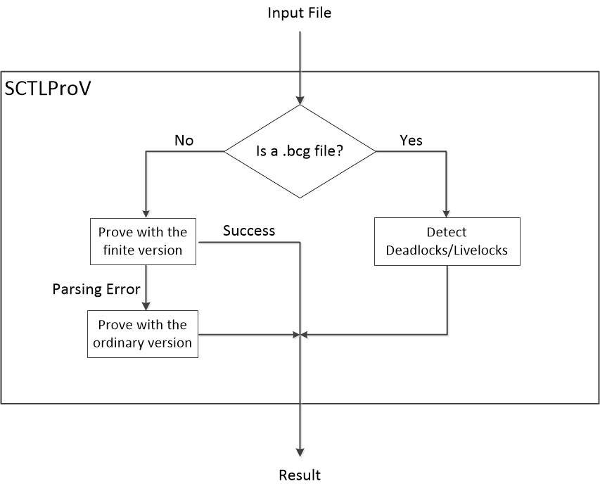

# SCTLProV

This repository includes three version of the SCTLProV prover, the difference of these three versions is the input language:

* **The ordinary version**: this version accepts the full input language of SCTLProV, which is specified in `./docs/language_specification.md`.

  This version is compiled by `make all`.
* **The finite version**: in this version, a state of a Kripke model can only be represented by a fixed number of integers (or Booleans). This version of SCTLProV accepts a restricted version of the input language:
    - No definition of types, values, or functions;
    - Data types can only have fixed ranges: booleans and scalars.

  The reason of keeping this version of SCTLProV is that, representing states as integer arrays (or Boolean arrays) is much more cache-firendly than in the ordinary version, where a state may be represented by a linked list, a record, or a variant, etc. This kind of representation of states is analogous to that in traditional model checkers, for instance, Verds or NuSMV. This version is more suitable for handling hardware model checking problems than the ordinary version. In practice, the finite version usually runs faster than the ordinary version.

  When using this version only, compile the source code with `make finite`.

* **The bcg version**, this version prove the existence of deadlocks or livelocks of BCG files.

  When using this version only, compile the source code with `make bcg`, otherwise, when not using this version, compile the source code with `make no-bcg`.

The way of the invokation of these three versions is as follows.

## Input Language
See `./docs/language_specification.md`.

## Compiling and Running
See `./docs/compiling_running.md`.

## Testing
See [this repository](https://github.com/sctlprov/sctlprov_testing).